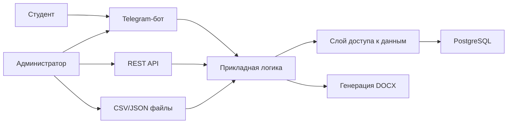
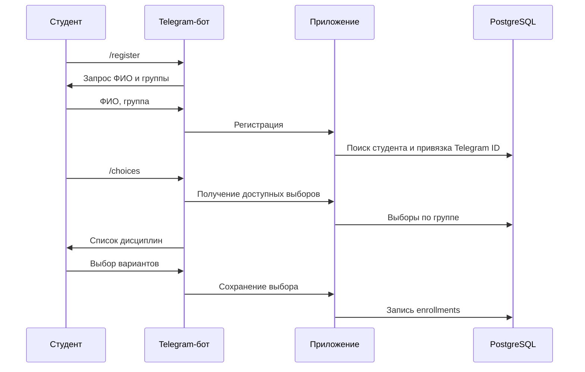
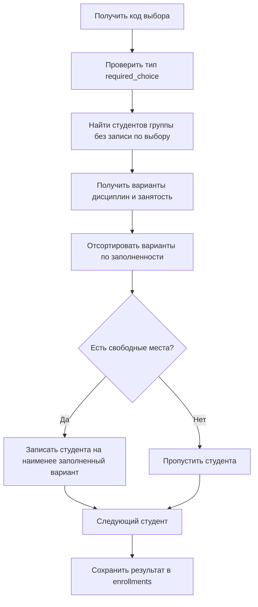
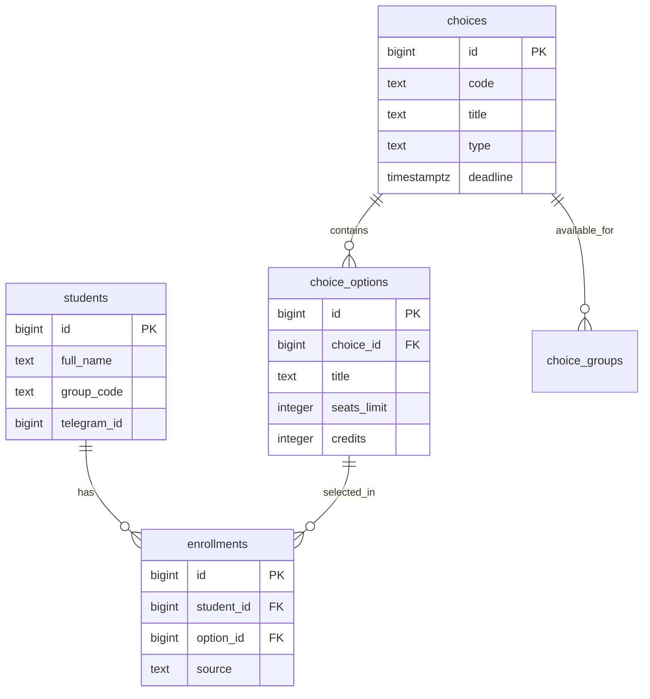

# Схемы для диплома

## Общая архитектура

```mermaid
flowchart LR
    Student["Студент"] --> Bot["Telegram-бот"]
    Admin["Администратор"] --> Bot
    Admin --> REST["REST API"]
    Bot --> Service["Прикладная логика"]
    REST --> Service
    Service --> Repo["Слой доступа к данным"]
    Repo --> DB["PostgreSQL"]
    Service --> DOCX["Генерация DOCX"]
    Admin --> Files["CSV/JSON файлы"]
    Files --> Service
```

## Сценарий студента

```mermaid
sequenceDiagram
    participant S as Студент
    participant B as Telegram-бот
    participant A as Приложение
    participant D as PostgreSQL
    S->>B: /register
    B->>S: Запрос ФИО и группы
    S->>B: ФИО, группа
    B->>A: Регистрация
    A->>D: Поиск студента и привязка Telegram ID
    S->>B: /choices
    B->>A: Получение доступных выборов
    A->>D: Выборы по группе
    B->>S: Список дисциплин
    S->>B: Выбор вариантов
    B->>A: Сохранение выбора
    A->>D: Запись enrollments
```

## Алгоритм автоматического распределения

```mermaid
flowchart TD
    Start["Получить код выбора"] --> CheckType["Проверить тип required_choice"]
    CheckType --> Students["Найти студентов группы без записи по выбору"]
    Students --> Options["Получить варианты дисциплин и занятость"]
    Options --> Sort["Отсортировать варианты по заполненности"]
    Sort --> HasSeat{"Есть свободные места?"}
    HasSeat -->|Да| Assign["Записать студента на наименее заполненный вариант"]
    HasSeat -->|Нет| Skip["Пропустить студента"]
    Assign --> Next["Следующий студент"]
    Skip --> Next
    Next --> Finish["Сохранить результат в enrollments"]
```

## ER-диаграмма

```mermaid
erDiagram
    students ||--o{ enrollments : has
    choice_options ||--o{ enrollments : selected_in
    choices ||--o{ choice_options : contains
    choices ||--o{ choice_groups : available_for

    students {
        bigint id PK
        text full_name
        text group_code
        bigint telegram_id
    }

    choices {
        bigint id PK
        text code
        text title
        text type
        timestamptz deadline
    }

    choice_options {
        bigint id PK
        bigint choice_id FK
        text title
        integer seats_limit
        integer credits
    }

    enrollments {
        bigint id PK
        bigint student_id FK
        bigint option_id FK
        text source
    }
```
